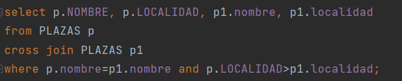

# Portfolio
## Reflexiones personales
## Resumen de los comandos más importantes aprendidos durante la unidad
#### Mediante esta unidad hemos aprendido diferentes conceptos, este trimestre ha estado centrado en las consultas, el primer tema estaba centrado en las consultas simples, las cuales estaban centradas en sacar los datos de una única tabla mediante el formato que nosotros quisiesemos, de modo que para conseguir estos resultados tuvimos que aprender como operar con diferentes funciones numéricas, textos nulos, el formato de las fechas, pudiendo extraer de ellas los datos que más nos interesasen, distintas conversiones las cuales nos permitían pasar a texto cualquier número o fecha y viceversa, convertir un texto a número o fecha. Como último punto de este tema encontramos las expresiones regulares, las cuales nos facilitaban el trabajo de escoger los datos necesarios que teníamos que sacar por consulta.
#### El siguiente tema fue el de consultas avanzadas, con las cuales mezclabamos lo aprendido anteriormente, con lo nuevo que ibamos a aprender en esta unidad, este tipo de consultas nos permitían, a diferencia de las anteriores, sacar datos de diferentes tablas mediante su relación, este tema contaba con dos apartados, el de consulta de varias tablas, con el cual aprendimos a ir "uniéndonos" con diferentes tablas mediante el comando join y su foreign key, la cual podía ser igual en las dos tablas y tendríamos que utilizar join ... using (..) o, por el contrario, podían no coincidir, con lo que usaríamos join ... on (..=..) para establecer la relación entre las dos tablas. El otro apartado es el referido a las consultas totales, las cuales implementan la capacidad de añadir sumas, contar las filas, calcular el máximo, mínimo, la media, las cuales, antes, no podíamos calcular de una forma sencilla, el problema de estas operaciones es que siempre van a ir acompañadas de un group by.
#### Estos dos temas me han servido para aprender consultas, tanto básicas como juntando varias columnas, una vez pasados los dos examenes podemos establecer una reflexión:
* Puntos positivos: a diferencia del primer tema, las consultas totales las he entendido bien, además, como este tema aplica el temario anterior, me ha servido para entender mejor el tema de las consultas básicas.
* Puntos en contra: me ha sido muy difícil aprender el primer tema debido a la cantidad de "clausulas" que este tiene, y la infinidad de combinaciones que se pueden hacer con ellas.
## Ejercicios significativos
#### Ejercicio 5 de la práctica de geografía

#### Ejercicio 11 práctica toros

#### Ejercicio 10 práctica toros 

####

####

## Ejercicios de invención propia

## Conclusiones
#### Respecto a estos dos temas dados, podemos dar ciertas conclusiones, como principales dificultades he encontrado, como ya he mencionado antes, la complejidad de aprenderse todas las combinaciones que se pueden hacer con las funciones, además de tener claro como completar ciertos ejercicios. Lo que más me ha gustado es poder realizar las consultas que nosotros queramos y con el formato que nosotros querameos.
